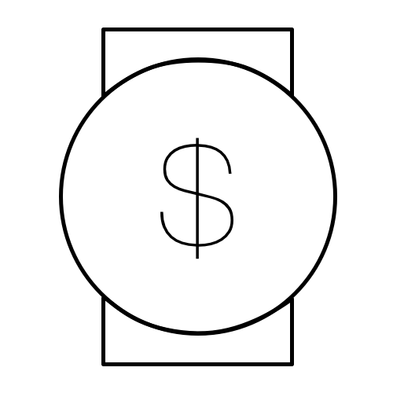

# monotime

> 💰 Money is time, a library to figure out what your time costs

[](https://www.npmjs.com/package/monotime)
[](https://lcov-server.gabrielcsapo.com/coverage/github%2Ecom/gabrielcsapo/monotime)
[](https://starbuck.gabrielcsapo.com/github/gabrielcsapo/monotime)
[](https://starbuck.gabrielcsapo.com/github/gabrielcsapo/monotime#info=devDependencies)
[](https://travis-ci.org/gabrielcsapo/monotime)


<pre align="center">
  
</pre>

# Installation

```
npm install monotime
```

## Example

```javascript
const monotime = require('monotime');

monotime('hourly', 27.692307692307693).get('15'); // $15 will cost you 0.5416666666666666 hours
```

## Usage

To use `monotime` as a standalone library without a bundler, use the bundle located at `dist/monotime.js`. Else if you are using webpack or any other bundler, simply `require('monotime')` will suffice!
